# DB query
create database userservice;
create user userservice;
grant all privileges on userservice.* to userservice;

1) once u add spring security dependency in pom ,by defaut it will make all api endpoint authenticated.
2) so add springsecurity configuration class to override this functionality
3) 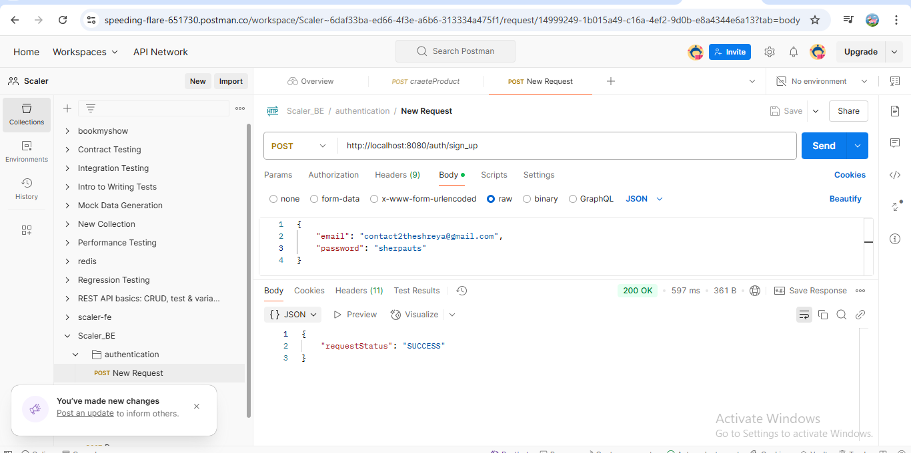
4) use apache common lang library to generate random string for toekn
5) 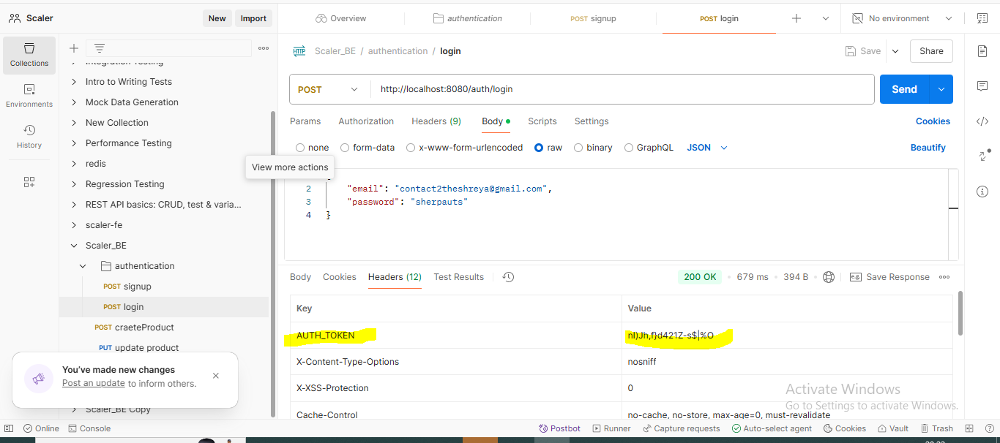
6) 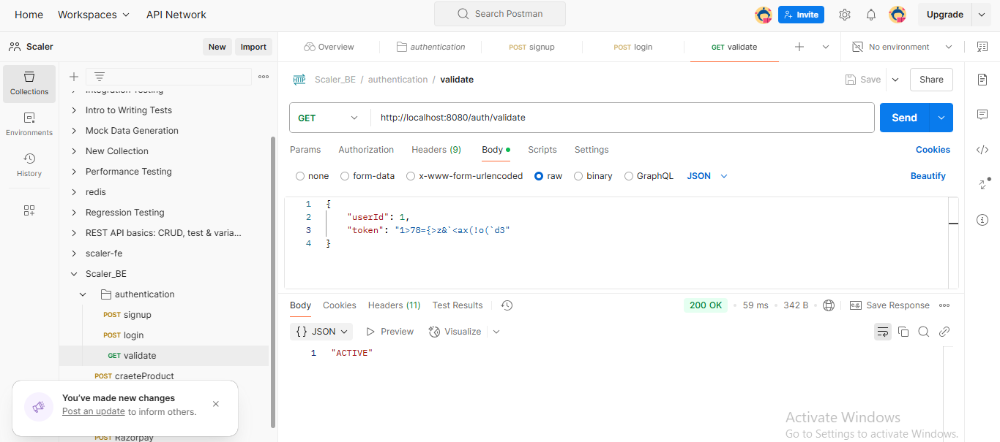
# Test with jwt
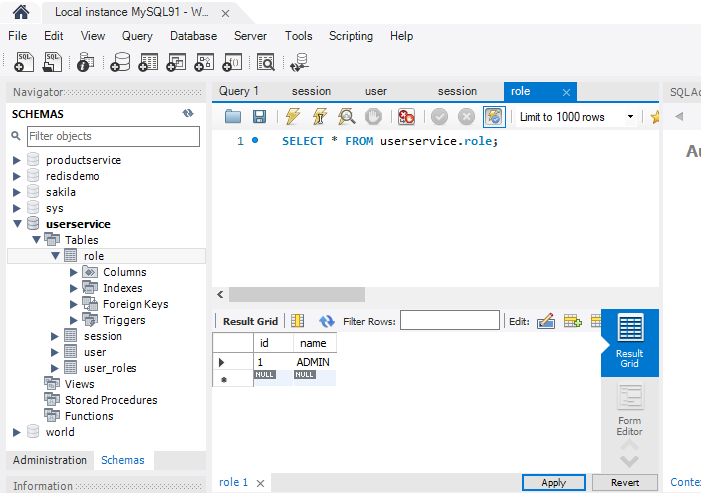
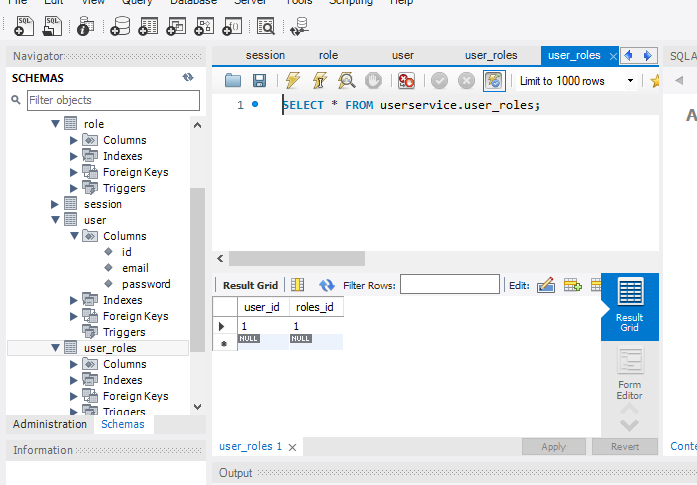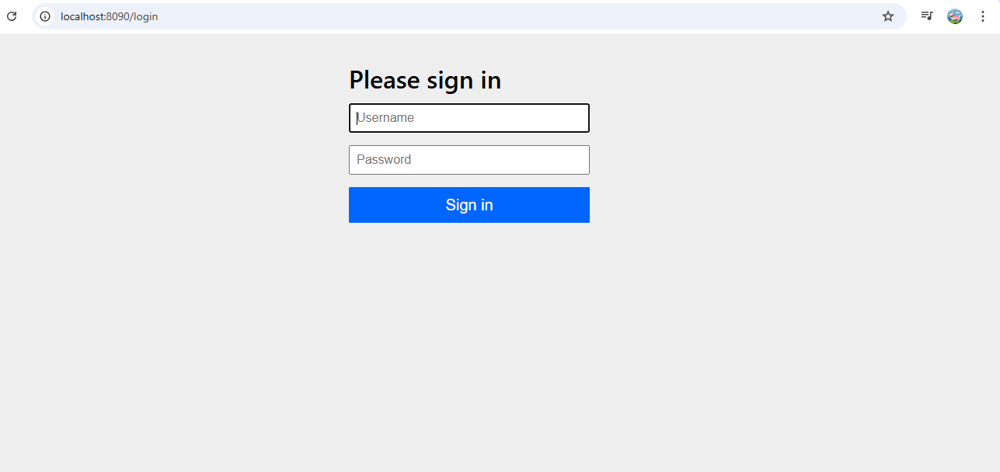
# OAUTH
As oauth is standard so many of client lke postman will be supporting tha standard
https://docs.spring.io/spring-authorization-server/reference/getting-started.html
Add security config file and copy code from above here u will get all info about oidc
postman config
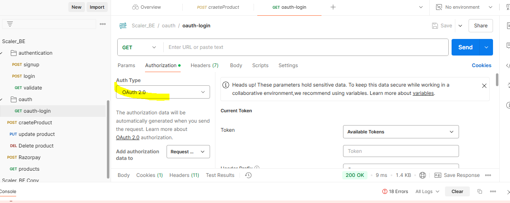
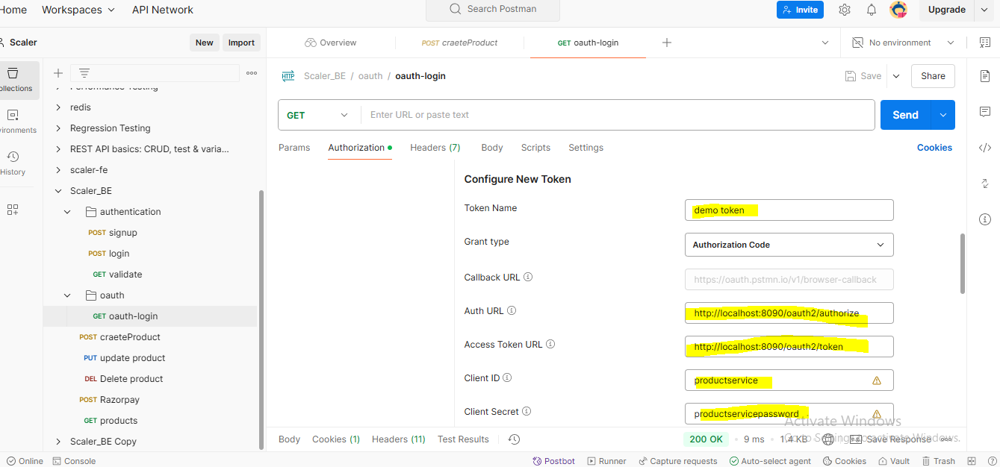
scope-openid profile
click on get new access token
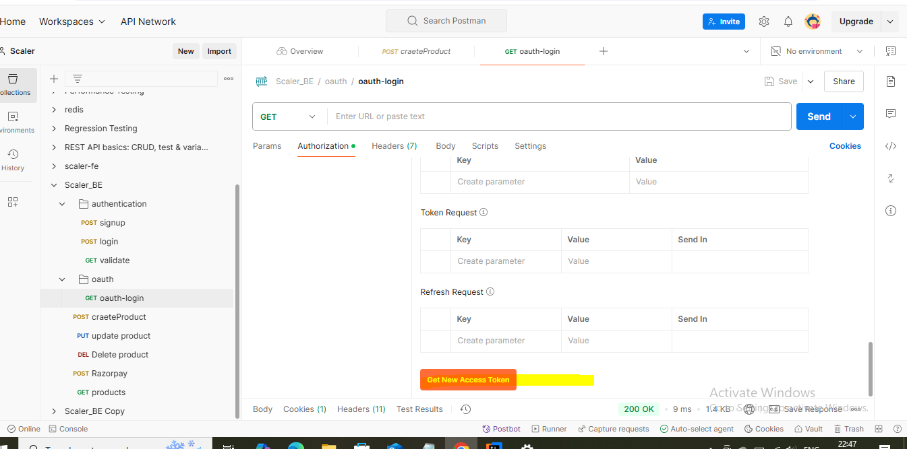

give permission afetr login
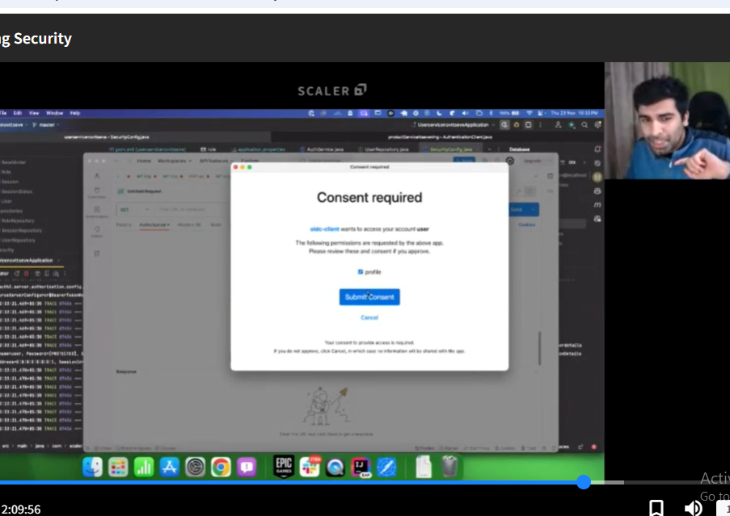 proceed and now toen is ready
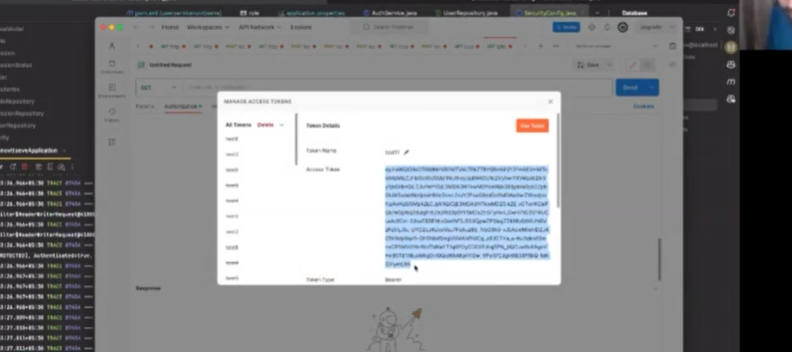
make custom user details and disable in memory db storage for oayth
before using goggle authorization server -sign in via google first u have to register
your client
currently registerdclient factoruy in code is in memory but google will store in it DB 
the information of its client
https://docs.spring.io/spring-authorization-server/reference/guides/how-to-custom-claims-authorities.html
https://docs.spring.io/spring-authorization-server/reference/guides/how-to-jpa.html

## Note
in mysql every row has size of 16KB thaat is 65,536bytes else jpa will give error
so one solution to use @Lob as text column not varchar in model coz this doesn't count as size of the row
Run insertclient test once and then comment out and pust same details in postman and run
tell spring securith it is safe to convert customuserdetails class in jwt-security restriction
so use @jsondeserialize-safe to deserialize to json

once postman generate token
complete jwt is stored in token as well as client information who logins and authorized this
login with contact2theshreya@gmail.com/sherpauts-user table
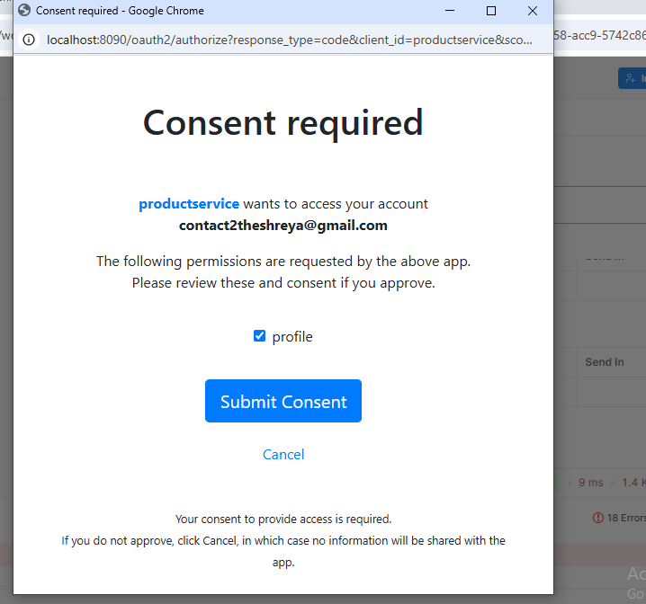
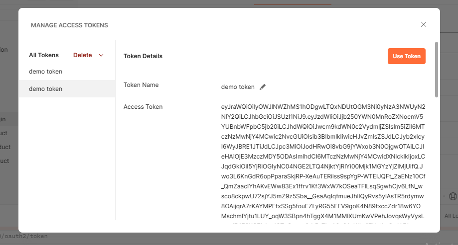
decode jwt token
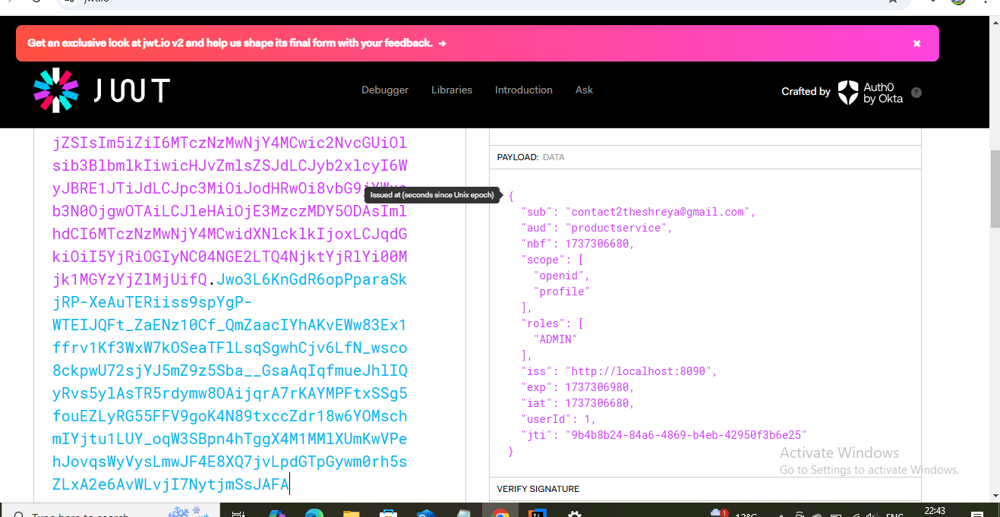
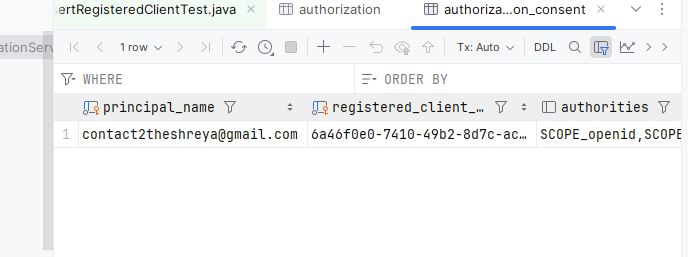
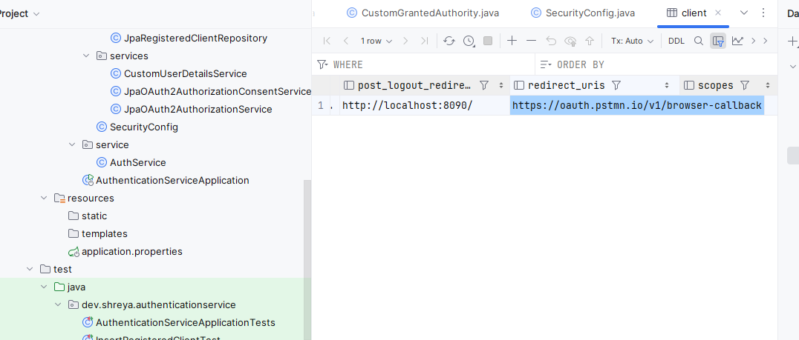

## Error and imp points
1) we are making spring authorization server who will generate token
2) goggle authzn server will also maintain information about client who is using this
3) so first create and register client in credential page of google cloud console
4) we will also store information about client in databse in authorization consent table and client table
5) client as an application that is gong to use authorization server
6) postman acts as (client)browser which hits backend
7) noop means it is stored as a plain text
8) @commit in test case then data will be saved in clinet table.
9) jackson to convert obj to json need default constructor
10) method startrs with get jackson think there is a field associated with that so make a field
11) if method name is isEnabled() field should be enabled
12) contact2theshreya(logged in user) gave permission to this clientid .(authorization consent table)
13) complete jwt is also stored in authorization table
14) first u have to register a client then only u can use authorization server
15) at the time client is registerdclient tells what all permission may it ever asked
16) scope is permission
17) getprincipal method-login user info

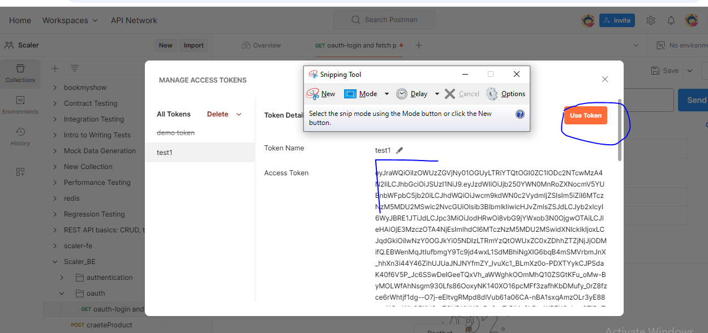