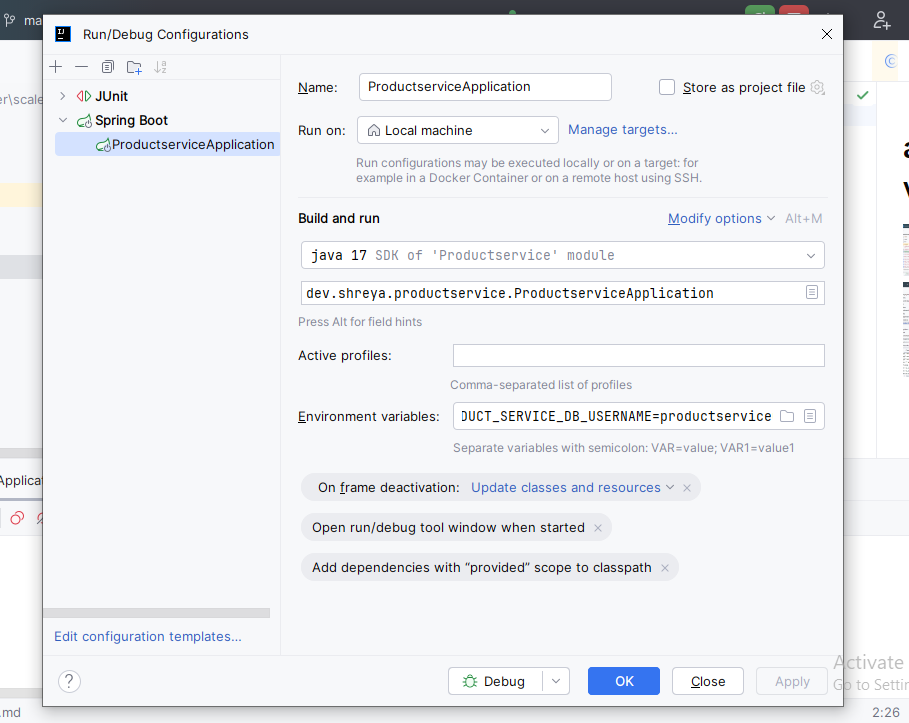

# add env variable

Restart intellij
Now connect to rds by using this endpoint

PRODUCT_SERVICE_DB_URL=jdbc:mysql://productservice.cvogqi8qofbm.ap-south-1.rds.amazonaws.com:3306/productservice; PRODUCT_SERVICE_DB_USERNAME=productservice;PRODUCT_SERVICE_DB_PASSWORD=productservice; SERVER_PORT=8080
Add data in database manually
For every rds try to create seperate rds 

## Do same step of creating databse for userservice in same rds instance
1) create databse userservice;
2) 
3) USER_SERVICE_DB_URL=jdbc:mysql://productservice.cvogqi8qofbm.ap-south-1.rds.amazonaws.com:3306/userservice;USER_SERVICE_DB_USERNAME=productservice;USER_SERVICE_DB_PASSWORD=productservice; SERVER_PORT=8090
3) Add data manually in user,role and user roles table with password of user bcrypt encoded like-
$2a$10$bdOzoe44OhNuzTtM5uumIern6zqN27uBD/aeJf3ktBPmD7/mRTnJm

# Elastic bean stalk
To deploy application we will use EBS,it configure proxy to forward req to application in port 5000

First code goes to dev env where only dev can see
when a developer has done its work then it gets deployed to staging env and not directly to dev environmente where other stakeholders
can revie the feature,staging env is very much like production(same kind of db)
Then it goes to production
we can define >1 environment for each application and for each env we can have separate configuration
see previous aws.md

ebs use other aws services behind the scene like load balancer so it needs permission to be able to use those services
u havve to tell ebs to create ec2 on my behalf so it needs a service role that has all of these permission
so create a role

create role with all permissiona nd assign to elastic bean stalk
availobility zone-datacenter
i dont want elastic bean to create dtaabsle for me

choose ndefault security group
Load e balancer decisdes which server user has to go to

EBS will create few ec2 instance in BG

it's a wrapper over other services to amke your ;ofe easier

set server_port to 5000 in ebs envieronment variable
run test case with these credentials in rds databse to get saved in client table

Now get new acess token
postman collection is saved-with name deployment

# Note

1) default port of http is 80,public user will hit on port 80 ,so LB will receive on port80 and forward it to port 5000 to my application
2) use this for instance profile-https://youtu.be/oU8yAF4Y90Y

## Deploy product service
3) add issuer url variable in authenticationservice.
4) unfortunately while running test cases environment variable is not read so comment out test case]
5) create new application of product servoice in EBS
6) instance profile is superset of role

12) 
13) 
14) 
## Note
For further research u can try with
7) 
8) instance tyoe-micro
9) if any request comes to port 80 pass that to default process
10) 
11) 
12) https://jun711.github.io/aws/how-to-pause-or-stop-elastic-beanstalk-environment-from-running/#google_vignette