key pair-kind of authentication that u are acessing your computer

key oair file is use for login in computer
http-acess web page over internet

ssh-acess computer over internet,can login to remote computer

by amazon public ip(not fixed) u cana cess website
u get differet ip whenever u restart instance
Amazon has service called elastic IP to buy static ip for production env

# EC2
can acess it from anywhere
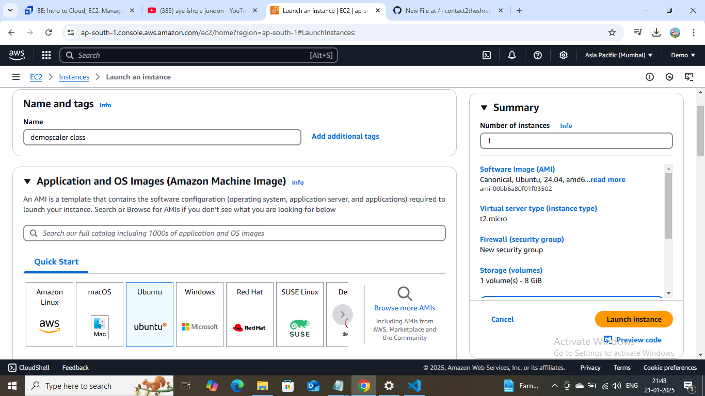
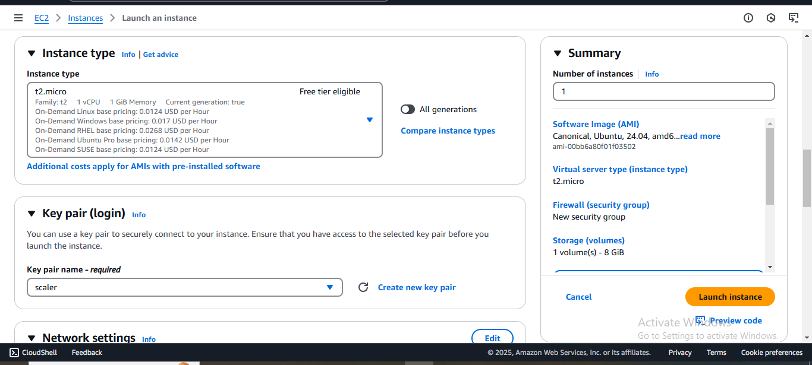
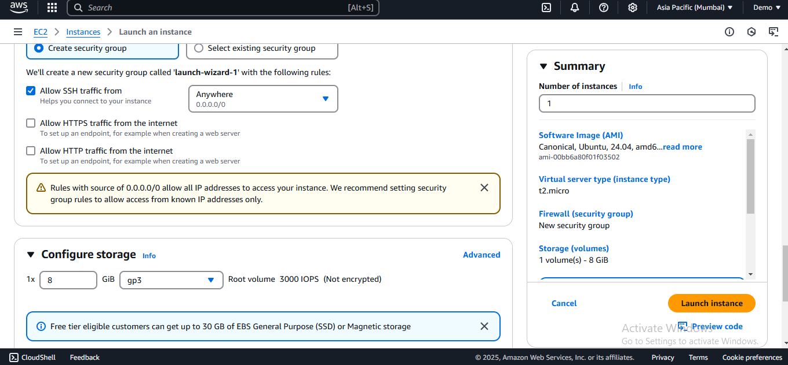
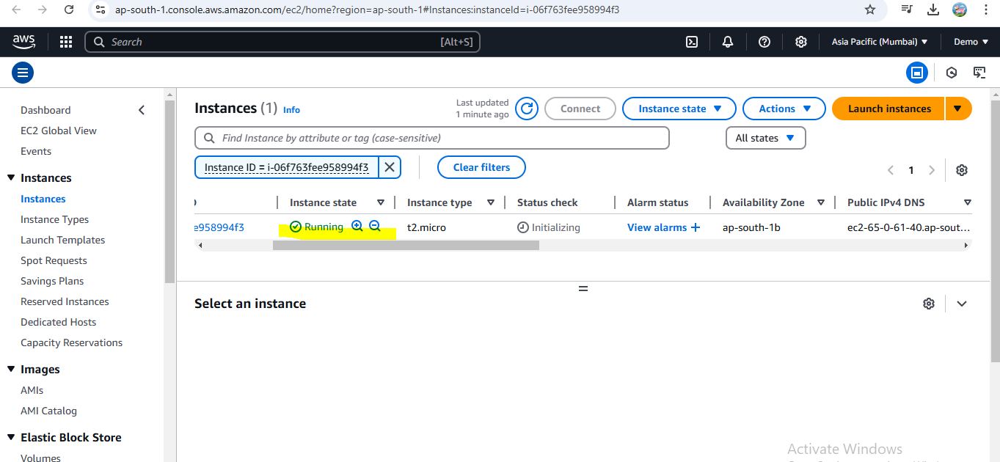
Now connect to this computer,click on checkbox and then connect and go to shs client tab and follow steps given
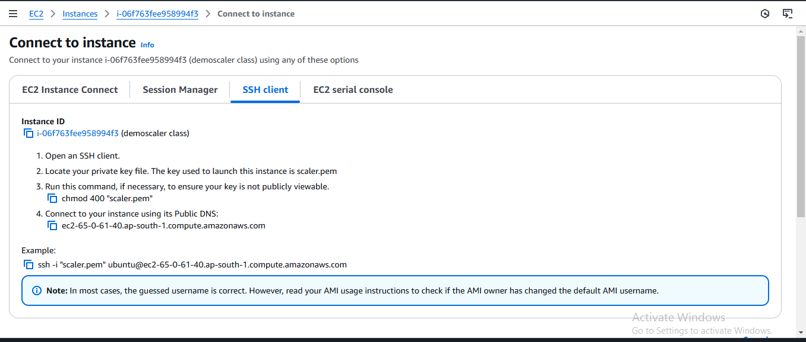
run all command in git bash where the file is present
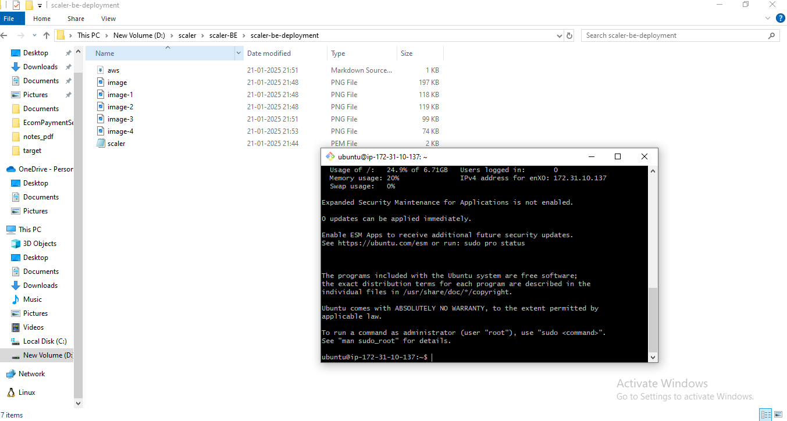
now install python and run ab server flask
https://flask.palletsprojects.com/en/stable/installation/
 1) mkdir myproject//ls -l  command to see information about files and directory in present folder
1) cd myproject
2) sudo apt-get update
3)sudo apt-get install python3 then sudo apt-get install python3-venv
4) python3 -m venv .venv
5) . .venv/bin/activate
6) pip install Flask

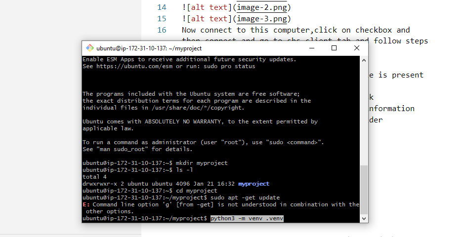

You should run sudo apt update whenever you want to install new software or check for updates. It ensures that your system has the most recent information about available packages. Without running this command, your package manager might not know about the latest versions, leading to outdated software being installed.

# Now create simple flask application
https://flask.palletsprojects.com/en/stable/quickstart/
create a file first by command in same git bash
1. nano hello.py
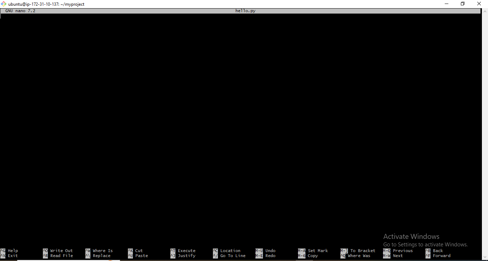
paste it 
from flask import Flask

app = Flask(__name__)

@app.route("/")
def hello_world():
    return "
Hello, World!
"

Now execute code option-ctrl +x and save file give Y
7)  flask --app hello run --host=0.0.0.0

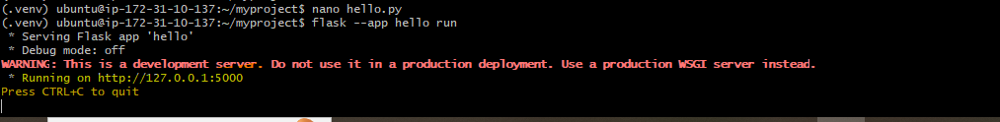
Now in browser go to aws ec2 publicip:port that is 65.0.61.40:5000
By default awsfor security pupose block all of the port of this machine ,it only allow by ssh but we want to connect via http on port 5000
so go to security and give inbound rule in security group
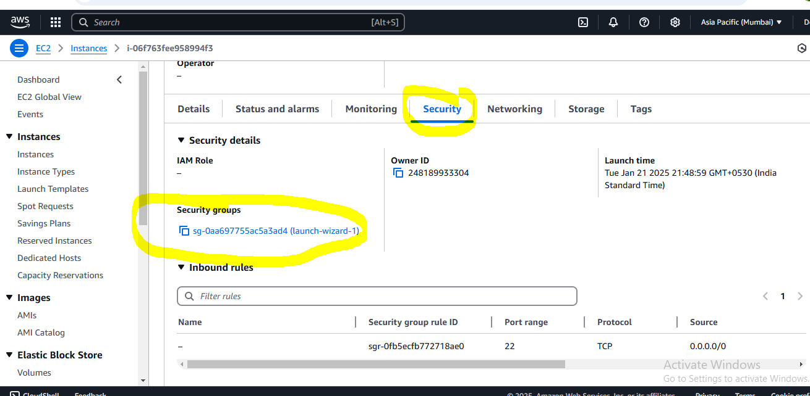
clcik on security group and edit inbound rules and select to acess it from any amchine
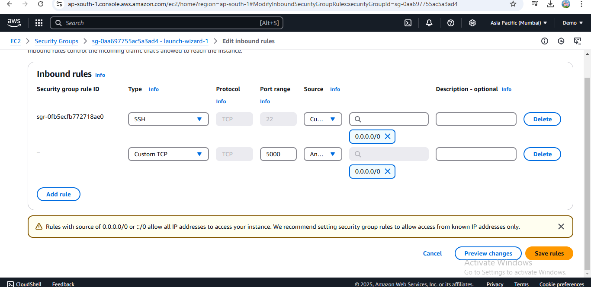
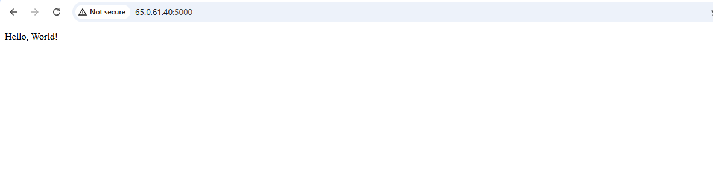
U can buy an staic ip from elastic ip service and associate to machine ten ip of machine will not change whene u restart system-aws will not charge if u allocate elastic ip to ec2 machine
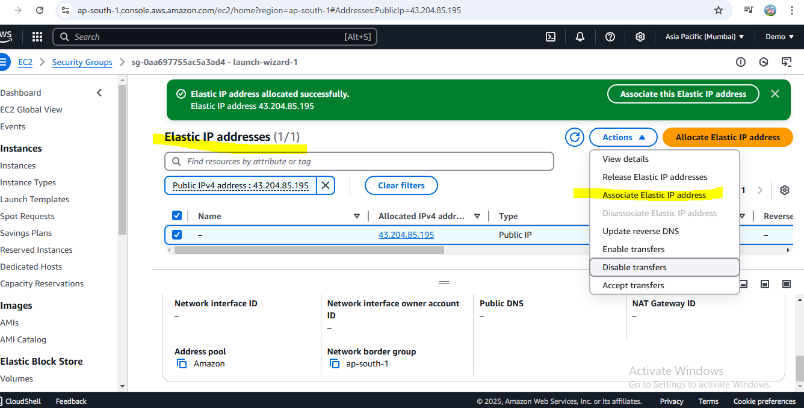
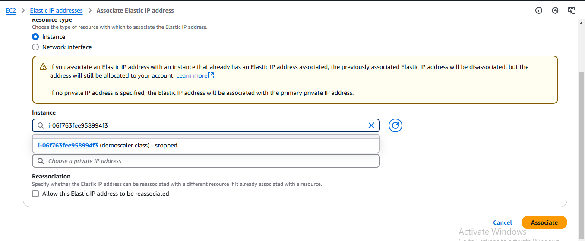 click on associate
whwen u shout down instance and restated , uneed to restrt flask applicatin
-cd myproject
-run flask server
elasticip:port
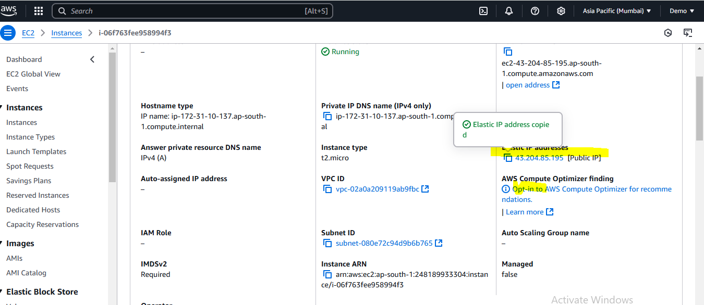
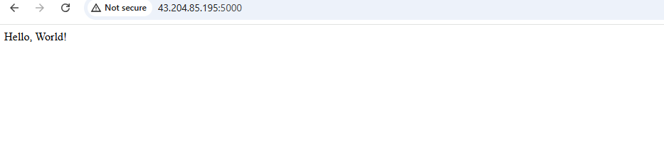
# Create rds instance
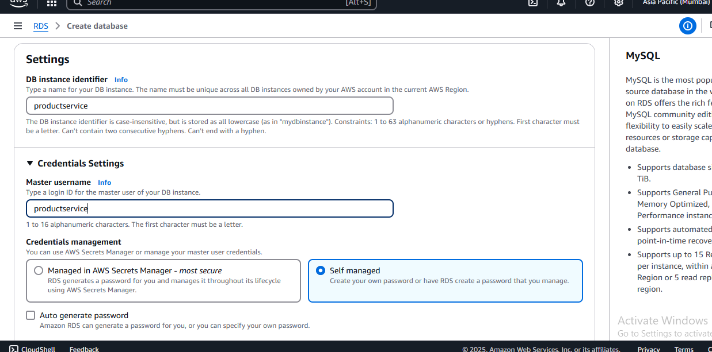
password is same as username
we only want oup application server to acess database so choose -public acess no
RDS doesn't assign a public IP address to the database. Only Amazon EC2 instances and other resources inside the VPC can connect to your database. Choose one or more VPC security groups that specify which resources can connect to the databas
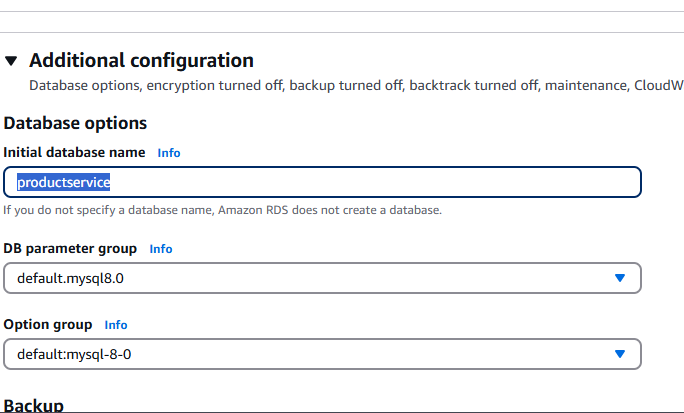
 

